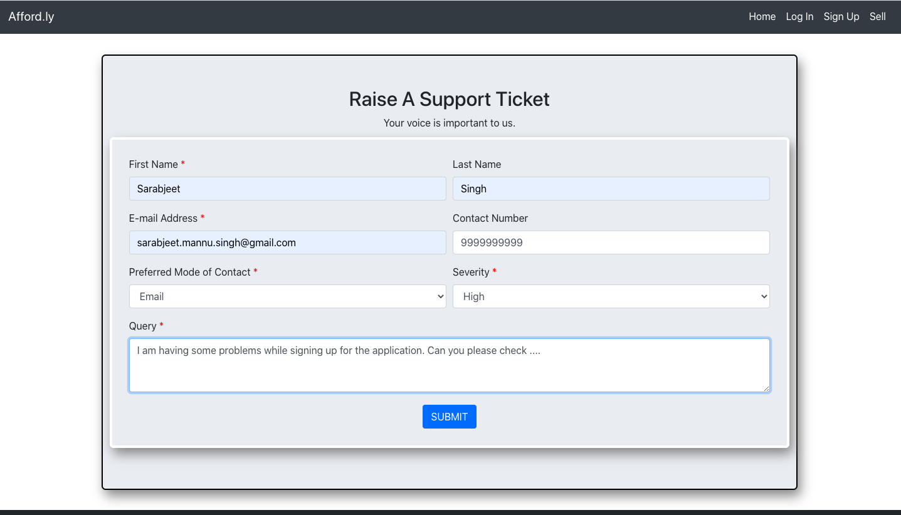

## [Affordly](https://the-affordly.herokuapp.com/)
One stop shop to buy and sell item.

Date Created: 23 JUL 2020
Last Modification Date: 25 JUL 2020

## Table of Content 

- [Author](#author)
- [Feature](#feature)
- [Tasks](#tasks)
- [User Experience and Feedback](#user-experience-and-feedback-)
- [Tech-Stack Information](#tech-stack-information-)
- [Architecture](#architecture)
- [Files-Information](#file-information-)
- [Feature specific files hierarchy](#feature-specific-files-hierarchy-)
- [Integration and Overall Flow](#integration-and-overall-flow-)
- [API information](#api-information-)
- [Prerequisites to run locally](#prerequisites-to-run-locally-)
- [Additional Features](#additional-features-)
- [Running and testing endpoints](#running-and-testing-endpoints-)
- [Codebase and Deployment](#codebase-and-deployment-)
- [Frameworks, technologies, and Tools used](#frameworks,-technologies,-and-tools-used-)
- [Source code attribution/references](#source-code-attribution/references-)
- [Acknowledgments](#acknowledgments)
- [References](#references)

## Author
**Sarabjeet Singh B00847541** - (Developer)

## Feature

I have selected “Raise a Support Ticket” feature to be implemented as part of this assignment. This feature has been put forward to enhance the overall experience of a user. While using the application, there are chances that users get stuck somewhere or might face some issues and needs to raise it to Affordly team. At that moment, this feature will come handy to them. The feature will present a form to fill in the details. Once filled and submitted, an email will be generated and sent from Affordly support team to the user entered email for all future references. To get the record of all the raised tickets the entered ticket details will be stored in Affordly database for our support team to investigate the issue at any time.

## Tasks

1. Setup a form in frontend to let user add the details about the issue.
2. Providing necessary backend and frontend validations to the form input.
3. Create an Application Programming Interface [1] (API) at backend
3.1. First API will be called from frontend as POST request with form data to initiate the e-mail sending service which will contain the necessary ticket details.
3.2. Second API will be called from frontend as POST request with form details to store the ticket data in the database for the support team to look into.
4. Once the email has been sent and details have been stored in database, a proper confirmation message will be sent to user.

## User Experience and Feedback

The overall feature is to enhance the user experience while exploring Affordly. At every step in designing the feature, users requirements and usage-environments have been carefully taken into consideration. For privacy reasons, contact-number (phone-number) has not been made mandatory. Proper front-end validations will assist the users to fill the form efficiently. Once user submits the form, success or error message will be shown at the top of page with red and green colour respectively to provide proper feedback to user's activity. As there are chances that emails or messages might be lost or misplaced, hence a pdf attachment containing the ticket details have also been attached to email which user can download and save for future references.
 
## Tech-Stack Information

The feature has been implemented with MERN [2] stack. 

1. Front end - Front end for the feature is being implemented with React.js [3] and all the necessary frontend validations have been put in place. 
2. Database - For maintaining the support ticket details in database MongoDb [4], a no-sql database, has been used. Mongoose [5] package has been used at backend with the fields - username, email, mode_of_contact, contact number, query, severity, and timestamps have been created to post details to database.
3. Back end – Node.js [6] and Express [7] framework has been used at backend to control logic and provide routing to specific APIs.

## Architecture 

The feature implementation has been done following the Model-View-Controller [8] (MVC) architecture. The view part is the frontend which is written and handled in React.js [3], while at the backend, model and controller for connection to database and routing to implementation logic respectively have been handled to support the frontend requests.

## File Information
File structure has been maintained as per the architecture discussed above.

### View:

A directory named “Affordly” contains the frontend or view for the application. Inside the src directory, components directory consists of all components .js/.jsx files and pages directory consists of complete pages .js/.jsx files. 

Feature specific (View) files under my ownership now: 

1. HTML/Javascript logic => **affordly/src/pages/incident.js** (contains all the html code and the rendering logic for the page. Initially developed by another team-member during frontend phase. I have modified it to provide field information, backend calls, and frontend validations)
)
2. CSS logic => **affordly/src/stylesheets/incident.css** (contains stylesheet attributes for the page html. Modified by me.)

### Model:

The backend logic for the application has been written in the directory “api”. The api is segregated in three directories contributing to models, routes, and controller. The Models directory consists of specific database models our application is maintaining.

Feature specific (Model) file under my ownership:

1. Database model for Support => **api/Models/SupportModel.js** (uses the Mongoose package and connected to MongoDb database and generates a “supports” model in the specified database collection)

### Controller:

Controller for an application handles the implementation logic for the application. Inside the same api directory, Routes and Controllers directories are maintained to handle the incoming api request and serve them with the appropriate business logic.

Feature specific (Controller) file under my ownership:

1. Sending Mail logic and Storing the ticket to database logic => **api/Controllers/SupportController.js** (business logic for sending mail and storing support ticket to db)
2. Routing to appropriate logic function => **api/Routes/SupportRoutes.js** (handles the routing logic at backend)

### Resources files under my ownership: 

While sending an email, a pdf document is generated and sent as an attachment to the mail. The generated pdf document and Affordly logo.png file is stored in public/document and public/images directories respectively.

Other than this specific feature, below stated files have been developed by me during frontend development phase.

1. affordly/src/pages/Posting.jsx (View posting page)
2. affordly/src/Components/Footer.jsx (Footer code for applciation)
3. affordly/src/Components/Map.jsx (Map visualization component in postings page)

## Feature specific files hierarchy

**frontend**

    |── affordly
    │   ├── build
    │   │   └── static
    │   │       ├── css
    │   │       ├── js
    │   │       └── media
    │   ├── package-lock.json
    │   ├── package.json
    │   ├── public
    │   └── src
    │       ├── components
    │          ├── Footer.jsx
    │           └── navbar.js
    │       ├── pages
    │           ├── incident.js 
    │       └── stylesheets
    │           ├── Footer.css
    │           ├── incident.css  
    │           ├── navbar.css

    **Backend**

    ├── api
    │   ├── Controllers
    │   │   ├── SupportController.js
    │   ├── Models
    │   │   ├── SupportModel.js
    │   └── Routes
    │       ├── SupportRoutes.js
    ├── package-lock.json
    ├── package.json
    ├── public
    │   ├── document
    │   │   └── SupportTicket_64b0d0f3-aba6-431a-929e-d097c97d9706.pdf
    │   └── images
    │       └── logo.png
    └── server.js 

## Integration and Overall Flow

When the user submits the form, React.js [3] uses the axios [9] service and calls 
the backend endpoint to provide the necessary form data. The backend will then 
invoke the Nodemailer [10] service to initiate the email to the user. Secondly, the backend 
will process the body parameters and use the mongoose [5] package to save the support ticket details to the database.

## API information

For developing the feature, I have written two APIs one of them handles the mail sending process while other handles the database operation.

1. Send mail API - this API will initiate the NodeMailer service with the form details sent over POST detail by frontend React.js 
      
       Endpoint =>  "/support/sendSupportTicket"
       Method => POST
       Body parameters=> name, email, query, contact_number, severity, mode(Mode of Contact)
       
      *** Note- All the above parameters are string
 
    
2. Create a ticket in Database - this API will create an entry in database for the new ticket entry with form details sent over POST detail by frontend React.js

       Endpoint =>  "/support/createTicket"
       Method => POST
       Body parameters=> name, email, query, contact_number, severity, mode(Mode of Contact)
       
    *** Note- All the above parameters are string
    
For testing the endpoints, Postman has been used on each of the discussed API.

## Prerequisites to run locally

1. Clone the git repository of the project.  -  https://github.com/tulianish/CSCI5709-Group2-Project
2. Once you have the code for project up and running on your local IDE, you need to install the node.js [6] and npm (node package manager) [11] on your system.
3. Download and install the node.js to your system. Once installed, go to the project root directory and install dependencies using npm [11].
     
     bash
     npm install

   This will install all the dependencies defined in the package.json file. Once all dependencies are installed, start the application by using the following command.
    
    bash
    node server.js 
       
The application will be up on port 3000 on your localhost.

## Additional Features

1.  HTML5 Semantic: There are no div tags in the code. Throughout the code, HTML5 syntax has been followed and section/figure semantic tags have been used.

2. W3C Compliant: The application built and feature w3c compliant.

3.  Validations: Dynamic front end validations have also been done apart from on Submit validation on raise a support ticket page. Through front-end validation the code will validate the user input as the user types it, hence enhances the overall user experience.

4. Mailing: Once user submits the form with his/her query, Nodemailer [10] package has been used in the backend which will use the smtp connection and initiates an appropriate e-mail with raised ticket details to the user.

5. Attached document: Apart from the e-mail, a pdf document with the ticket details has also been generated and sent as an attachment to e-mail. This will let user save the document for all future references.

6. Database cache: On successful submission, the entries for the raised ticket have been saved into the database under supports collection for the future reference of the support team.

7. Cross-Browser Capability: The application has been thoroughly tested on multiple browsers such as Chrome, Safari, and Firefox.

## Running and testing endpoints

The application will be launched on Heroku deployed link or on localhost:3000 locally. For testing purpose, the feature can be accessed from the endpoint/url stated below.

**URL/endpoint**:

Raise a Support Ticket => “/incident”

**Deployment Link**:

Raise a Support Ticket => https://the-affordly.herokuapp.com/incident

**Steps from UI**:

Homepage -> Footer section link (Raise a Support Ticket)

Although no test cases have been written using any framework, but thorough testing has been done on front-end validations and handling corner cases.

## Codebase and Deployment

The feature with the complete application has been deployed to Heroku and maintains a direct pipeline from [Github private repository](https://github.com/tulianish/CSCI5709-Group2-Project) to Heroku [12].
I pushed all my code to my feature branch: [SarabjeetSingh_SupportTicketFeature](https://github.com/tulianish/CSCI5709-Group2-Project/tree/SarabjeetSingh_SupportTicketFeature)  which at the end merged with the master branch of the repository.

## Frameworks, technologies, and Tools used

For designing front-end, writing backend logic, and deployment, I have used specific technologies as per my requirement.

- Nodejs [6]- Server to serve my application.
- React.js [3] - Javascript library to design the frontend.
- React-bootstrap [13] - One of the oldest React libraries used to design form and its elements.
- Github [14] - Source-code maintainer.
- Heroku [12]- Used for deployment and continuous integration with GitHub. 

## Source code attribution/references

For providing front-end validations, I have referred and studied an article [15] and tried to implement the logics at my end.
Please note that the article was referred only to study the basics and gain some head start over front-end validation technique.

File: Incident.js
Lines 138-192 (handleOnChange function)

**Code snippet**

      handleOnChange = (element) => {
        element.preventDefault();
        const name = element.target.name;
        const value = element.target.value;
        let error = this.state.error;
        switch (name) {
          case "name":
            if (document.getElementsByClassName("name").value === "") {
              error.name = "";
              break;
            }
            error.name =
              value.length < 3
                ? "First Name must be at least 3 characters long..."
                : "";
            break;
          case "email":
            if (document.getElementsByClassName("mail").value === "") {
              error.email = "";
              break;
            }
            error.email = emailCheck.test(value) ? "" : "Invalid Email Address...";
            break;
    
          case "contact_number":
            if (document.getElementsByClassName("contact_number").value === "") {
              error.contact_number = "";
              break;
            }
            error.contact_number =
              value.length < 10
                ? "Contact number must be at least 10 digits long..."
                : "";
            break;
    
          case "query":
            if (document.getElementsByClassName("query").value === "") {
              error.query = "";
              break;
            }
            error.query =
              value.length < 15
                ? "Query must be at least 15 characters long..."
                : "";
            break;
          default:
            break;
        }
        this.setState({
          error,
          [name]: value,
          success: false,
          empty: false,
          errors: false,
        });
      };

## Acknowledgments

1. Professor Gabreilla Mosquerra for outstanding lectures
2. Tutorial-2 - by Aadesh Shah - Helped us in deploying the application on Heroku.
3. edpresso - To give me the headstart for react form-validation.
4. Document submitted as Assignment-3 [16] by me. 

## References

[1] "Application programming interface", En.wikipedia.org, 2020. [Online]. Available: https://en.wikipedia.org/wiki/Application_programming_interface.  [Accessed: 21- Jul- 2020].

[2] "MERN Stack - GeeksforGeeks", GeeksforGeeks, 2020. [Online]. Available: https://www.geeksforgeeks.org/mern-stack/.  [Accessed: 23- Jul- 2020].

[3] "Getting Started – React", Reactjs.org, 2020. [Online]. Available: https://reactjs.org/docs/gettingstarted.html. [Accessed: 22- Jul- 2020].

[4] "Guides", Docs.mongodb.com, 2020. [Online]. Available: https://docs.mongodb.com/guides/.  [Accessed: 22- Jul- 2020].

[5] "Mongoose v5.9.25: Getting Started", Mongoosejs.com, 2020. [Online]. Available: https://mongoosejs.com/docs/.  [Accessed: 22- Jul- 2020].

[6]"Docs | Node.js", Node.js, 2020. [Online]. Available: https://nodejs.org/en/docs/.  [Accessed: 04- Jun2020].

[7] "Express 5.x - API Reference", Expressjs.com, 2020. [Online]. Available: https://expressjs.com/en/5x/api.html.  [Accessed: 22- Jul- 2020].

[8] "Model–view–controller", En.wikipedia.org, 2020. [Online]. Available: https://en.wikipedia.org/wiki/Model%E2%80%93view%E2%80%93controller.  [Accessed: 23- Jul- 2020].

[9] "axios", npm, 2020. [Online]. Available: https://www.npmjs.com/package/axios.  [Accessed: 23- Jul- 2020].

[10] A. Reinman, "Nodemailer :: Nodemailer", Nodemailer.com, 2020. [Online]. Available: https://nodemailer.com/about/.  [Accessed: 23- Jul- 2020].

[11] "npm Documentation", Docs.npmjs.com, 2020. [Online]. Available: https://docs.npmjs.com.  [Accessed: 23-Jul- 2020].

[12] "Heroku Dev Center", Devcenter.heroku.com, 2020. [Online]. Available: https://devcenter.heroku.com/. 
[Accessed: 23- Jul- 2020].

[13] React-bootstrap.github.io, 2020. [Online]. Available: https://react-bootstrap.github.io/gettingstarted/introduction.  [Accessed: 23- Jul- 2020].

[14] "Build software better, together", GitHub, 2020. [Online]. Available: https://github.com/.  [Accessed: 23- Jul- 2020].

[15] "React form validation", Educative: Interactive Courses for Software Developers. [Online]. Available:
https://www.educative.io/edpresso/react-form-validation.  [Accessed: 23- Jul- 2020].

[16] "Unsupported Browser", Dal.brightspace.com, 2020. [Online]. Available: https://dal.brightspace.com/d2l/lms/dropbox/user/folders_history.d2l?db=72101&grpid=0&isprv=0&bp=0&ou=124056.  [Accessed: 24- Jul- 2020].

